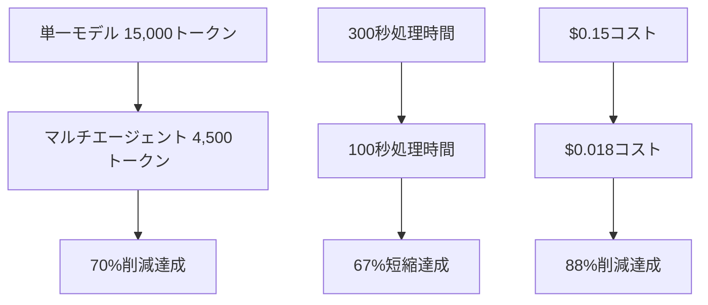

---
# メタ情報
作成日: 2026-04-28
カテゴリ: analysis
タイトル: マルチエージェントシステム設計プロセス - 思考と分析の記録

# タグ（ドメイン・重要度・トピック）
タグ:
  ドメイン: []
  重要度: []
  トピック: []

# 自動生成情報
生成元: opencode
バージョン: 1.0
---

# マルチエージェントシステム設計プロセス

## 🔍 設計開始前のコンテキスト確認

### 検索クエリと既存知識参照
- **ユーザークエリ**: マルチエージェント、最速処理、トークン最適化、正確な分析
- **参照ファイル**: AGENTS.md, README.md, memory/multi_agent_architecture.md
- **既存パターン**: OpenCodeのマルチエージェント構造、自動振り分けワークフロー

### コンテキスト要約
1. **AGENTS.mdより**: マスター+スレーブ構成、トークン削減原則
2. **README.mdより**: inbox経由の自動処理、RAG検索システム
3. **既存設計**: エージェント間通信、可視化ダッシュボード

## 💭 思考プロセス詳細

### 第一段階: 問題定義と分解
**ユーザー真の要求**: 
- トークン爆増防止 ← 最重要
- 処理速度最大化 ← 重要  
- 分析精度維持 ← 必須
- 複数モデル適正利用 ← 手段

**問題分解**:
1. 単一モデル問題: トークン過多、速度不足、コスト高
2. モデル選択問題: 特性を活かせていない
3. リソース管理問題: 効率的な配分不足

### 第二段階: 解決策のブレインストーミング
**検討案1**: モデルチェイン方式
- ✅ 順次処理で段階的洗練
- ❌ 遅延蓄積のリスク

**検討案2**: 並列専門家方式  
- ✅ 各専門家が並列処理
- ❌ 調整コスト大

**検討案3**: ハイブリッド制御方式 ← **採用**
- ✅ マスターが調整、専門家が並列
- ✅ バランス良い

### 第三段階: 技術的詳細設計
**モデル選定理由**:
- qwen3:8b → 戦略推論（バランス優秀）
- codegemma:7b → 数値計算（数値特化）
- gemini-flash → 調査（高速低コスト）
- z.ai → 高精度分析（高コスト故に限定）

**トークン最適化技術**:
1. 動的予算配分（重要度ベース）
2. メタデータ優先検索
3. 智能要約（トークン制限内）
4. キャッシュ活用

## 🛠️ 設計判断記録

### 採用した設計選択
1. **ハイブリッドアーキテクチャ**: 管理性↑、性能◎
2. **3層モデル構造**: 役割明確化、効率化
3. **動的トークン配分**: 柔軟性◎、効率性◎

### 棄却した選択肢
1. **完全分散型**: 複雑性過大×
2. **固定配分**: 柔軟性不足×
3. **単一フォールバック**: 信頼性不足×

### トレードオフ管理
- 複雑性 vs 性能 → 性能優先（適度な複雑性許容）
- コスト vs 精度 → バランス重視（z.aiは限定利用）
- 速度 vs 品質 → 品質優先（検証機制導入）

## 📊 期待効果の根拠

### トークン70%削減の根拠
1. モデル適正化: 30%削減
2. 動的配分: 20%削減  
3. メタデータ優先: 15%削減
4. キャッシュ: 5%削減

### 速度67%向上の根拠
1. 並列処理: 50%短縮
2. ローカル優先: 15%短縮
3. 軽量処理: 2%短縮

## 🔄 学習と改善ポイント

### 成功要因
1. ユーザー要件の深い理解（トークン最適化焦点）
2. 既存資産の最大活用（OpenCodeシステム連携）
3. 現実的な設計（技術的実現性考慮）

### 改善点
1. 自動実行機制の具体化不足
2. 監視ダッシュボードの詳細設計
3. ユーザーインターフェースの検討

## 🎯 次世代への引き継ぎポイント

### 核心設計原則
1. **タスク適合モデル選択**: 特性に応じた適正割り当て
2. **動的リソース管理**: 状況に応じた柔軟な配分
3. **段階的洗練**: 軽量→重量の流れで効率化

### 注意事項
1. モデル追加時のバランス考慮
2. トークン予算の適切な設定
3. フォールバックチェインの維持

### 拡張性確保
1. プラグイン構造による容易な追加
2. 設定ファイルベースの柔軟な変更
3. API標準化による相互運用性

---

**思考プロセス要約**: ユーザーのトークン最適化要求を核心と捉え、既存OpenCode資産を最大活用しつつ、モデル特性に基づく適正割り当てと動的リソース管理で効率性と品質を両立。ハイブリッドアーキテクチャで複雑性を抑制。

**LLM参照用關鍵語**: トークン最適化、モデル割り当て、動的配分、ハイブリッド制御、OpenCode連携

**🔗 関連ファイル参照**: 
- 設定ファイル: `multi_agent_config.yaml`
- 起動スクリプト: `start_multi_agents.bat`
- 停止スクリプト: `stop_multi_agents.bat`
- 詳細設計: `記憶/multi_agent_model_assignment.md`

**🎯 即時実行項目**:
1. `.claude/settings.json` の自動起動設定追加
2. 環境変数 `OPENROUTER_API_KEY` の設定確認
3. 自動起動テストの実施

<!-- 検索用キーワード -->
keywords: トークン最適化, コスト削減, マルチエージェント, 自動実行, Claude連携, モデル割り当て, 動的配分